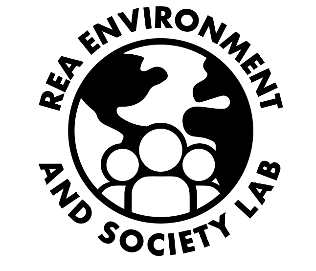

## Rea, Merten, and Rife (2024) Replication Code

This Github repository contains all of the code used in Rea, Merten, and
Rife (2024), “Outcomes and Policy Focus of Environmental Litigation in
the United States,” *Nature Sustainability*.

The repository contains seven primary scripts and a range of other
supporting files including supporting functions, data crosswalks,
manually coded variables, and supporting data sources, all of which are
needed to fully replicate all visualizations and analyses present in
Rea, Merten, and Rife (2024). We share this full suite of data and code
in the spirit of full transparency and open science.

## Getting Started

Running this replication code requires having the underlying raw data,
which is accessible via the Harvard Dataverse. There are two primary
data sources.

1.  FJC IDB Data - The largest share of the analysis draws on data taken
    from the Federal Judicial Center Integrated Database (FJC IDB) Civil
    Data, available at <https://www.fjc.gov/research/idb>. The specific
    FJC IDB data used in Rea, Merten, and Rife (2024) is available in
    the Dataverse:
    <https://dataverse.harvard.edu/dataverse/rea_merten_rife_2024_NS>.

    > Placing these FJC IDB files in the /Data/FJC_raw directory with
    > names unchanged (but perhaps shifting the file extension from .tab
    > to .txt) will allow the scripts to run seamlessly.

2.  RESL ELD Data - Rea, Merten, and Rife (2024) also draws on the Rea
    Environment and Society Lab Environmental Law Database (RESL ELD).
    This data is also available in the Dataverse:
    <https://dataverse.harvard.edu/dataverse/resl_eld>.

    > Placing this RESL ELD file in the /Data/RESL directory with its
    > name unchanged (but perhaps shifting the file extension from .tab
    > to .csv) will allow the scripts to run seamlessly.

## Running the Code

This code repository is not ourganized around a primary or “meta” script
that, with a single call, calls each individual sub-script in the
repository to run through all the code.

Instead, each script, numbered 1 to 7, should must be run manually and
sequentially to move from raw data to all of the final outputs included
in Rea, Merten, and Rife (2024).

> **Note:** One partial exception is the fourth script,
> 04-reliabilityR.R, which can be skipped without consequence for script
> 05. That is, one can run script 03 and skip straight to script 05
> without consequence. Script 04 computes inter-coder reliability scores
> and does not modify (e.g. filter or reshape) the data in any way that
> would impact subsequent analysis.

Once the raw data files are located in the proper directories, run each
script in its entirety, sequentially omving from script 01 to 07, to
reproduce all analyses and visualizations in Rea, Merten, and Rife
(2024).

## Output

The scripts will automatically write out all output to the appropriate
directories.

All figures, including visual representations of regression results
(forest plots) will be populated in the /Figures directory.

Regression results tables and summary statistics will populate their
corresponding folders in the /Data directory.

Intermediate forms of data, e.g., after filtering, reshaping, joining,
and recoding, will populate the /Data/FJC_preprocessed and
/Data/FJC_postprocessed directories and subsequent sub-directories.

## Further Documentation

Basic documentation of the FJC IDB data is available via the Federal
Judical Center directly, at <https://www.fjc.gov/research/idb>.

Detailed documentation on the content and assembly of the RESL ELD is
available via the [RESL ELD Process
Documentation](https://docs.google.com/document/d/1cLVq71dIXMKAhXpye3WG9Iy0PVMU2x3o9vp2YoWa7Ow/edit?usp=sharing).

A detailed comparison of FJC IDB and RESL ELD data, which makes
strengths and weaknesses of each data source apparent, is available in
the Supplemental Information to Rea, Merten, and Rife (2024).

## Questions?

Please direct all questions, including discoveries of suspected errors
or missteps, to Dr. Chris Rea, founding PI of the Rea Environment and
Society Lab (RESL).
